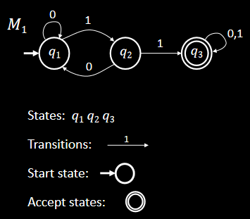
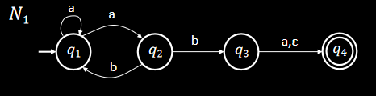
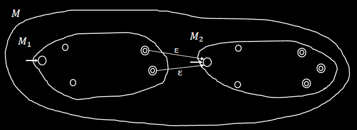
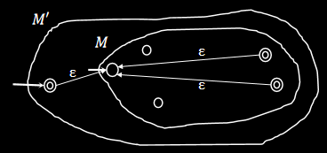
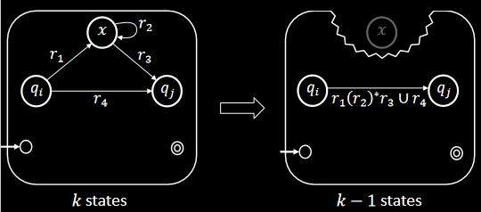

# 正则语言
1. 有穷自动机
2. 非确定性
3. 正则表达式

---

### 有穷自动机————一个例子

---

### 有穷自动机————形式化定义
Def：**有穷自动机**是一个5元组$(Q,\Sigma,\delta,q_0,F)$
> 1. $Q$是一个有穷集合，称为**状态集**；
> 2. $\Sigma$是一个有穷集合，称为**字母表**；
> 3. $\delta:Q\times \Sigma \rightarrow Q$是**转移函数**；
> 4. $q_0 \in Q$是**起始状态**；
> 5. $F \subseteq Q$是**接受状态集**。

---

### 有穷自动机————计算的定义
设$M=(Q,\Sigma,\delta,q_0,F) $是一台有穷自动机，$w=w_1 w_2...w_n$是一个字符串且对任意$w_i$都有$w_i \in \Sigma$。若存在$Q$中的状态序列$r_0 r_1 r_2...r_n$满足：
> 1. $r_0 = q_0$（从起始状态开始）；
> 2. $\delta(r_i,w_{i+1}) = r_{r+1},i = 0,1...n-1 $；
> 3. $r_n \in F$（以接受状态结束）。

则称$M$**接受$w$**

---

### 正则语言————例子
> - Def：若A是机器M接受的全部字符串的集合，称A是机器M的语言，记作$L(M) = A$
> - Def:若一种语言被一台有穷自动机接受，称这种语言为**正则语言**

例子：$L(M_1)=\{ w|w包含字串11\} $

---

### 正则运算及其性质
对象是正则语言的运算
设A和B是两个语言，定义正则运算**并、连接、星号**如下：
> 1. 并：$A\cup B = \{ x|x \in A 或x \in B \} $
> 2. 连接：$A \circ B = \{xy|x\in A且x\in B \}$
> 3. 星号：$A* = \{x_1x_2...x_k|k\geqslant 0且每一个x_i \in A \}$

例子：令$A=\{a,b\},B=\{c,d\} $
- $A\cup B = \{a,b,c,d\}$
- $A\circ B = \{ac,ad,bc,bd\} $
- $A* = \{\epsilon,a,b,aa,bb,ab,aabb,...\} $

---

### 正则运算的封闭性：并运算
定理：若$A_1,A_2$为正则语言，则$A_1\cup A_2$为正则语言  
证明：
> 不妨设自动机$M_1 = (Q_1,\Sigma,\delta_1,q_1,F_1)$识别$A_1$,$M_2 = (Q_2,\Sigma,\delta_2,q_2,F_2)$识别$A_2$  

---

### 正则运算的封闭性：并运算

我们可以构建自动机$M = (Q,\Sigma,\delta,q_0,F)$，其中

- $Q = Q_1 \times Q_2 = \{(q_1,q_2)|q_1\in Q_1且q_2 \in Q_2\}$
-  $\delta((q_1,q_2),a) = (\delta_1(q_1,a),\delta_2(q_1,a))$,$a\in \Sigma$
- $q_0 =(q_1,q_2) $
- $F = \{(r_1,r_2)|r_1 \in F_1或r_2 \in F_2 \}$

---

### 正则运算的封闭性：连接运算
似乎无法直接参照并运算的思路，构建一个自动机来完成任务，因为不知道在哪里分开输入。
例子：
- $A_1 = \{以1结尾的字符串\} ,A_2 = \{以0结尾的字符串\}$
- $输入：001100 $
这需要引入非确定性的概念

---

### 非确定性————引入
*性质*：
1. 一个状态可以是若干个转移箭头的起点（0，1或更多）
2. 状态转移可以不需要输入，即直接跳到下一个状态（箭头上标有$\epsilon$）
3. 只要有一条路径的终点是接受状态即接受该输入

例子：

---

### 非确定性————形式化定义
Def 1.17:非确定性有穷自动机（简称NFA）是一个五元组$(Q,\Sigma,\delta,q_0,F)$：
> 1. $Q$是一个有穷集合，称为**状态集**；
> 2. $\Sigma$是一个有穷集合，称为**字母表**；
> 3. $\delta: Q\times (\Sigma \cup \{\epsilon\})\rightarrow \mathcal{P} (Q)$是转移函数（即从一个状态可以转移到若干个状态，而非一个）
> 4. $q_0 \in Q$是**起始状态**；
> 5. $F \subseteq Q$是**接受状态集**。

---

### 非确定性————NFA与DFA的等价性
显然可以用非确定性有穷自动机（NFA）表示确定性有穷自动机（DFA），只需证：可以用DFA表示NFA

*要点*：DFA可以追踪NFA中所有状态的任意子集

*证明*：不妨设NFA:$N = (Q_0,\Sigma,\delta_0,q_0,F_0)$
构造DFA：$M = (Q_1,\Sigma,\delta_1,q_1,F_1)$
- $Q = \mathcal{P} (Q_0)$
- $\delta_1(R,a) = \{q\in Q_0|存在r\in R,使得q\in\delta_0(r,a)\}$
- $F_1 = \{R \in Q_1 | R包含N的一个接受状态\}$

---

### 用NFA证明正则运算的封闭性:连接运算
*思路*：增加一些$\epsilon$箭头，这些箭头从前一种语言的接受状态指向后一种语言的起始状态

---

### 用NFA证明正则运算的封闭性:星号运算
*思路*：增加一些$\epsilon$箭头，这些箭头从的接受状态指向起始状态

---

### 正则表达式
我们可以利用正则运算，从零开始递归地定义正则表达式（正则语言的起点是有穷自动机）：
Def：我们称$R$是一个正则表达式，如果：
> 1. $a$，即字母表$\Sigma$中的一个元素
> 2. $\epsilon$，即仅包含空串的语言
> 3. $\emptyset$, 即不包含任何字符串的语言
> 4. $R_1 \Box R_2$，其中$R_1,R_2$为正则表达式，$\Box$是并运算或连接运算
> 5. $R_1*$，其中$R_1$是正则表达式

---

### 正则表达式与有穷自动机的等价性：$\rightarrow$
定理：如果一个语言可以用正则表达式描述，则这个语言是正则的

*思路*：将正则表达式转化为一台识别这种语言的NFA

---

### 正则表达式与有穷自动机的等价性：$\leftarrow$
定理：如果一个语言是正则的，则这个语言可以用正则表达式描述

*思路*：将接受这个语言的DFA转化为广义非确定性有穷自动机（GNFA），再将这台GNFA转化为2-状态GNFA，则仅剩的转移方程就是要求的正则表达式

---

### 广义有穷自动机(GNFA)
Def：GNFA就是转移箭头可以用任意正则表达式作标号的非确定性有穷自动机。

---

### GNFA$\rightarrow$正则表达式
引理：每个GNFA$G$都有等价的正则表达式$R$

证明：对GNFA $G$的状态数$k$作归纳证明

归纳基础（$k=2$）：只有一个箭头，这个箭头描述的字符串就是$R$

归纳步骤：假设对$k-1$个状态为真，下证该引理对$k$个状态为真。

---

### 非正则语言与泵引理
*问题*：我们该如何知道一个语言是否是正则语言？

泵引理：若A是一个正则语言，则存在一个数p使得：若$s$是A中任一长度不小于p的字符串，则s可以被分成3段，$s=xyz$，满足下列条件：
> 1. 对每一个$i \geqslant 0,xy^iz \in A$
> 2. $|y| > 0$
> 3. $|z| \leqslant p$

---

### 泵引理的证明

*证明思路*：令$p$为识别A的DFA的状态数，若一个字符串的长度大于p，则根据鸽巢原理，有穷自动机处理过程必然经历了两个相同的状态，可根据这两个状态来划分$x,y,z$

---

### 证明一种语言是非正则语言
> 1. 假设语言$A$是正则的
> 2. 根据泵引理，找到长度p并将字符串划分为$xy^iz$
> 3. 构造字符串$s$,使之长度大于$p$且不符合泵引理的划分要求

---

## 谢谢！